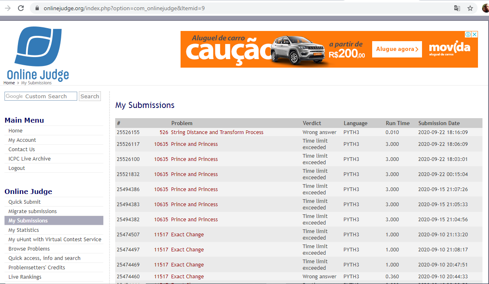

# Trabalho de Programação- Programação Dinâmica -- Parte 2
**Autor:** Edimar Antonio da Cruz
**Data:** 17 de setembro de 2020
**Problema:** 00526 -- Edit Distance
## Sobre a Solução
Este diretório contém o código fonte gerado para solucionar o problema 00526
do *Online Judge*. O problema recebeu veredito \Wrong answer", como mostrado na
figura abaixo:

O programa foi desenvolvido em Python, não entendi o problema e fiz um código
que aparentemente atendeu a um dos casos como mostrado no código, mas não
atende a outras entradas, portanto segue com erros
